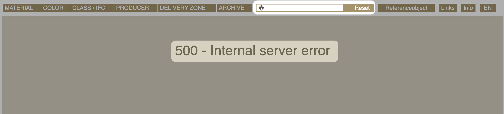
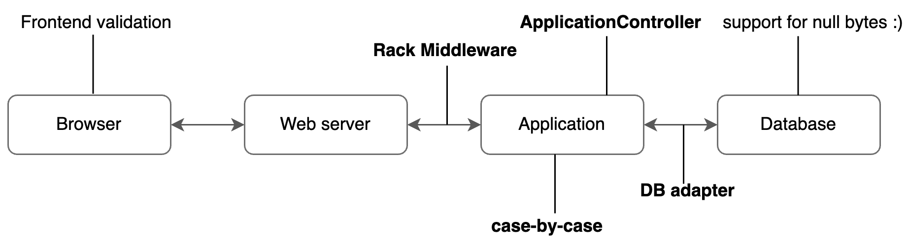
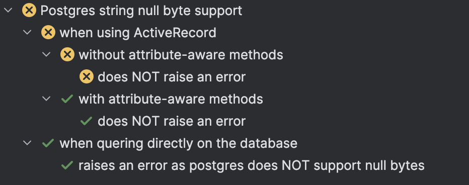
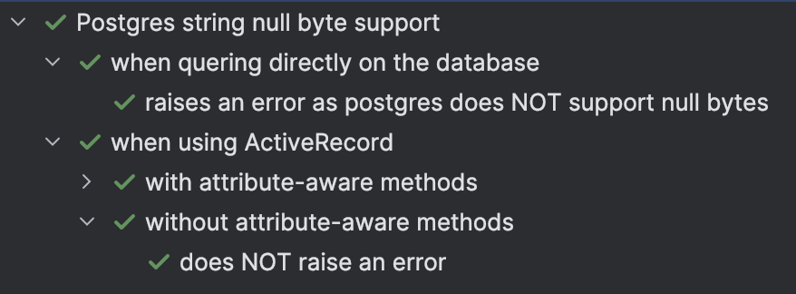

<!-- _class: renuo -->

<style scoped>
  * { text-align: center; }

  h1 { font-size: 55px; }
  h3 { font-size: 35px; margin-bottom: 50px; }
</style>

# Postgres and Null Bytes

### Strategies to handle null bytes

2024-11-27
Simon Isler @ On, Zurich

---

# 

# whoami

- Simon
- Software Engineer @ Renuo AG since 2019
- github.com/simon-isler

---

# Agenda

1. Problem
2. Background information
3. Approaches
4. Takeaways
5. Questions

---

<style scoped>
h1 { text-align: center; }
</style>

# Rails x Postgres

---

<style scoped>
h1 { text-align: center; }
</style>

# The problem

---


---



---

<style scoped>
h1 { text-align: center; }
</style>

# Postgres does not support null characters in text values.

---

# What are null bytes?

- conventionally, a zero byte was reserved to mark the end of a string
- nowadays, most programming languages treat zero bytes with much more passivity 
  -> Strings are usually no longer null-terminated

As a result, zero bytes can occur in text (for whatever reason).

---

# Is it still "valid" Unicode text then?

Yes.

- UTF-8 defines a zero byte as code point `0`
- no basis given for rejecting null characters in the Unicode standard

---

# Why does Postgres not support null bytes?

- backend (written in C) is over 30 years old
- PostgreSQL's UTF-8 text type does not allow zero bytes

---

```ruby
class BooksController < ActionController::Base
  def show
    @books = Book.find_by(name: book_params[:name])
    render plain: @books.count
  end

  private

  def book_params
    params.require(:search).permit(:name)
  end
end

class BooksControllerTest < Minitest::Test
  include Rack::Test::Methods

  def test_index
    get "/book", search: { name: "\u0000" }
    assert last_response.ok? # ArgumentError: string contains null byte
  end
end
```

---

<style scoped>
* { text-align: center; }
</style>

# Support for null bytes would be a breaking change

most relational databases however support null bytes 

---

<style scoped>
h1 { text-align: center; }
</style>

# Let's try to find a solution for Rails apps

---

1. **How** should we handle null bytes? (ignore, error?)
2. **Where** should we handle null bytes? (case-by-case, `ApplicationRecord`, rack?)

---

<style scoped>
h1 { text-align: center; }
</style>

# (1) How should we handle null bytes?

---

# Strategies

1. Replace (sanitization)
2. Throw an error (e.g. HTTP `422 Unprocessable Content`)
3. Ignore and let Postgres raise (HTTP `500 Internal Server Error`)

---

# Pro & cons

| Strategy                   | Pro                                                        | Con                                                                        |
| -------------------------- | ---------------------------------------------------------- | -------------------------------------------------------------------------- |
| Replace                    | - user request doesn't raise an error                      | - ignores valid unicode (`bytea` e.g. supports zero bytes)                 |
| Error (Rails)              | - Custom error, error page based on status code (422 e.g.) | - marks the request as invalid                                             |
| Ignore (error at PG level) | - No custom logic required                                 | - marks the request as invalid <br> - Internal server error might be unexpected|

(depends highly on use-case)

---


---

<style scoped>
h1 { text-align: center; }
</style>

# (2) Where should we handle null bytes?

---

# Approaches



---

# Before application layer

Middleware to handle null bytes before they go to the application


---

```ruby
module MyApplication
  class Application < Rails::Application
    require "./app/middleware/validate_request_params.rb"

    config.middleware.insert_before Rack::Head, ValidateRequestParams
  end
end
```

---

```ruby
class ValidateRequestParams
  INVALID_CHARACTERS = [
    "\u0000" # null bytes
  ].freeze

  def initialize(app)
    @app = app
  end

  def call(env)
    request = Rack::Request.new(env)

    invalid_characters_regex = Regexp.union(INVALID_CHARACTERS)

    has_invalid_character = request.params.values.any? do |value|
      value.match?(invalid_characters_regex) if value.respond_to?(:match)
    end

    if has_invalid_character
      return [422, {}, ["Bad Request"]]
    end

    @app.call(env)
  end
end
```

---

# Limitations

- replaces null bytes for any incoming String (also if a user wants to save something to a `bytea` field)
- overhead
  - recursion would be required to check JSON objects
- runs only at HTTP level
  - `Model.find_by(attribute: "test\00")` will still raise

---

# Defining the requirements

```ruby
RSpec.describe 'Postgres string null byte support' do
  let(:search_term) { "test\00" }

  context 'when quering directly on the database' do
    pending 'next slides'
  end

  context 'when using ActiveRecord' do
    pending 'next slides'
  end
end

```

---

```ruby
context 'when quering directly on the database' do
    let(:query) do
      ActiveRecord::Base
        .connection
        .execute("SELECT * FROM materials where materialcode = '#{search_term}'")
    end

    it 'raises an error as postgres does NOT support null bytes' do
      expect { query }.to raise_error(ArgumentError).with_message('string contains null byte')
    end
end
```

---


```ruby
context 'when using ActiveRecord' do
    context 'with attribute-aware methods' do
      let(:query) { Material.where(name: search_term) }

      it 'does NOT raise an error' do
        expect { query }.not_to raise_error
        expect(query.first).to be_nil
      end
    end

    context 'without attribute-aware methods' do
      let(:query) { Manufacturer.where('manufacturers.name ILIKE ? ', search_term) }

      it 'does NOT raise an error' do
        expect { query }.not_to raise_error
        expect(query.first).to be_nil
      end
    end
end
```

---

<style scoped>
h1 { text-align: center; }
</style>

# Application layer

---

# Case-by-case

Sanitizing attributes case-by-case

```ruby
class User < ApplicationRecord
  normalizes :email, with: ->(str) { str&.delete("\u0000") })
end
```

(`normalizes` was added to `ActiveRecord::Base` with Rails 7.1)

---

Normalization is applied when the attribute is **assigned or updated**.

```ruby
user = User.find_by!(email: "test\00") # => # <User:0x000000001x987261 id: 1, email: "test">
User.exists?(email: "test\00") # => true
```

The normalization is also applied to the corresponding keyword argument of **finder methods**.

```ruby
user = User.find_by!(email: "test\00") # => # <User:0x000000001x987261 id: 1, email: "test">
User.exists?(email: "test\00") # => true
```

However, normalization will not be applied when you pass the attribute value in the raw query:
```ruby
User.exists?(["email = ?", "test\00"]) # => ArgumentError: string contains null byte
```

---

# Limitations

- We would have to remember to apply this change everywhere...
- Having the attribute value in the raw query still raises

---

# ApplicationRecord

```ruby
class ApplicationRecord < ActiveRecord::Base
  self.abstract_class = true
  
  def self.inherited(subclass)
    super

    subclass.class_eval do
      return unless table_exists?

      string_attributes = columns_hash
                            .select { |_name, column| column.type == :string }
                            .keys
                            .map(&:to_sym)

      return if string_attributes.empty?

      normalizes(*string_attributes, with: ->(str) { str&.delete("\u0000") })
    end
  end
end
```

---

This would normalize all string attributes yes, but leaves us still with an issue:

```ruby
User.exists?(["email = ?", "test\00"]) # => ArgumentError: string contains null byte
```

<br>



---

```ruby
# active_record/normalization.rb
module ActiveRecord
  module Normalization
    extend ActiveSupport::Concern

    module ClassMethods
      def normalizes(*names, with:, apply_to_nil: false)
        names.each do |name|
          attribute(name) do |cast_type|
            NormalizedValueType.new(
              cast_type: cast_type, normalizer: with, normalize_nil: apply_to_nil
            )
          end
        end

        self.normalized_attributes += names.map(&:to_sym)
      end
    end
  end
end
```

---


```ruby
# active_record/attributes.rb
def attribute(name, cast_type, options = {})
  name = name.to_s
  clear_caches_calculated_from_columns
  
  # Assign a new hash to ensure that subclasses do not share a hash
  self.user_provided_columns = user_provided_columns.merge(name => cast_type)

  if options.key?(:default)
    self.user_provided_defaults = user_provided_defaults.merge(name => options[:default])
  end
end
```

---

<style scoped>
* { text-align: center; }
</style>

# Postgres adapter patch

Digging deeper into the stack

---

# ActiveModel types

```ruby
# active_model/type/string.rb
module ActiveModel
  module Type
    class String < ImmutableString

      private
        def cast_value(value)
          case value
          when ::String then ::String.new(value)
          when true then @true
          when false then @false
          else value.to_s
          end
        end
    end
  end
end
```

---

```ruby
# active_model/type.rb
module ActiveModel
  module Type
    @registry = Registry.new

    class << self
      attr_accessor :registry
    end

    register(:string, Type::String)
    register(:time, Type::Time)
  end
end
```


---

```ruby
attribute :email, :string
```

---

# Postgres types

```ruby
module ActiveRecord
  module ConnectionAdapters
    class PostgreSQLAdapter < AbstractAdapter
      class << self
        def initialize_type_map(m)
          register_class_with_limit m, "varchar", Type::String
          m.alias_type "char", "varchar"
          m.alias_type "name", "varchar"
          m.alias_type "bpchar", "varchar"
        end
      end


      ActiveRecord::Type.register(:jsonb, OID::Jsonb, adapter: :postgresql)
      ActiveRecord::Type.register(:vector, OID::Vector, adapter: :postgresql)
    end
  end
end
```

---

```ruby
# active_model/type/value.rb
module ActiveModel
  module Type
    class Value
      # Casts a value from the ruby type to a type that the database knows how
      # to understand. The returned value from this method should be a
      # +String+, +Numeric+, +Date+, +Time+, +Symbol+, +true+, +false+, or
      # +nil+.
      def serialize(value)
        value
      end
    end
  end
end
```

---

# PostgresString type

```ruby
module ActiveRecord
  module ConnectionAdapters
    module PostgreSQL
      module OID
        class PostgresString < Type::String
          def serialize(value)
            super(PostgreSQL::StringUtils.strip_null_bytes(value))
          end

          private

          def cast_value(value)
            super(PostgreSQL::StringUtils.strip_null_bytes(value))
          end
        end
      end
    end
  end
end
```
---

# Adapter patch

```ruby
# config/initializers/postgres_string_null_byte_support.rb
module ActiveRecord
  module ConnectionAdapters
    class PostgreSQLAdapter < AbstractAdapter
      class << self
        alias original_initialize_type_map initialize_type_map

        def initialize_type_map(m = type_map) # rubocop:disable Naming/MethodParameterName
          original_initialize_type_map(m)
          register_class_with_limit m, 'varchar', OID::PostgresString
        end
      end

      ActiveRecord::Type.register(:string, OID::PostgresString, adapter: :postgresql)
    end
  end
end
```

---

# Result



---

# Takeaways

- Solution to handle null bytes can be done at many layers and depends highly on your use case
- Approach can be pretty straightforward (frontend validation) or go deep into Rails internals

---

<!-- _class: renuo -->

# 

# Thanks!

### https://github.com/renuo/postgres-null-bytes-talk

---

# Sources
 
 - https://www.commandprompt.com/blog/null-characters-workarounds-arent-good-enough
 - https://stackoverflow.com/questions/29320369/coping-with-string-contains-null-byte-sent-from-users
 - https://discuss.rubyonrails.org/t/is-it-possible-to-override-default-database-types/79017
 - Postgres full UTF-8 support discussion: https://www.postgresql.org/message-id/5aa1df8a-96f5-1d14-46fd-032e32846c71%408kdata.com
 - Rack middleware: https://joshfrankel.me/blog/don-t-let-the-null-bytes-bite

---

<!-- _class: renuo -->

# Appendix

---

# Full adapter patch

```ruby
module ActiveRecord
  module ConnectionAdapters
    module PostgreSQL
      module Quoting
        alias original_quote quote

        def quote(value)
          original_quote(StringUtils.strip_null_bytes(value))
        end
      end
    end

    class PostgreSQLAdapter < AbstractAdapter
      class << self
        alias original_initialize_type_map initialize_type_map

        def initialize_type_map(m = type_map) # rubocop:disable Naming/MethodParameterName
          original_initialize_type_map(m)
          register_class_with_limit m, 'varchar', OID::PostgresString
        end
      end

      ActiveRecord::Type.register(:string, OID::PostgresString, adapter: :postgresql)
    end
  end
end
```